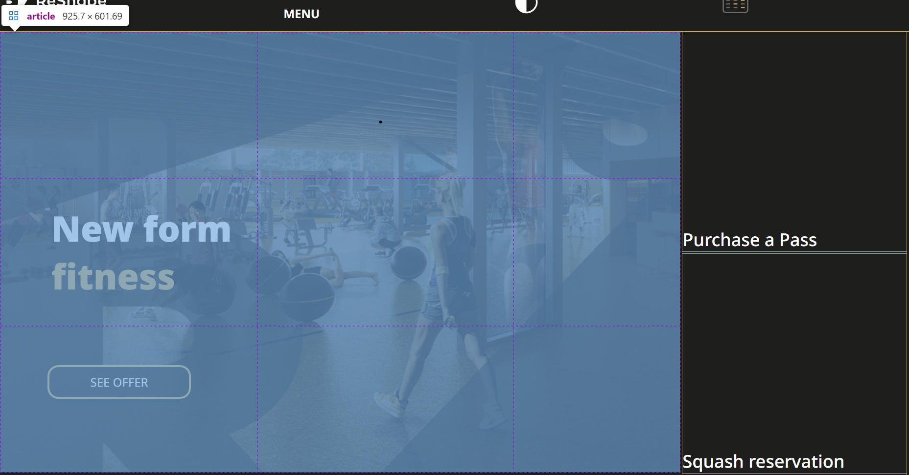

# Procesverslag
Markdown is een simpele manier om HTML te schrijven.  
Markdown cheat cheet: [Hulp bij het schrijven van Markdown](https://github.com/adam-p/markdown-here/wiki/Markdown-Cheatsheet).

Nb. De standaardstructuur en de spartaanse opmaak van de README.md zijn helemaal prima. Het gaat om de inhoud van je procesverslag. Besteedt de tijd voor pracht en praal aan je website.

Nb. Door *open* toe te voegen aan een *details* element kun je deze standaard open zetten. Fijn om dat steeds voor de relevante stuk(ken) te doen.

## Jij

  
uitwerken voor kick-off werkgroep

  ### Auteur:
  Ocean Gonen

  #### Je startniveau:
  hier je startniveau ROOD

  #### Je focus:
  hier je focus RESPONSIVE
 

## Je website

  
uitwerken voor kick-off werkgroep

  ### Je opdracht:
  [link naar de website die je gaat namaken óf de naam/omschrijving van je eigen ontwerp](https://reshape.pl)

  #### Screenshot(s) van de eerste pagina (small screen): 
  hier de naam van de pagina  
  

  #### Screenshot(s) van de tweede pagina (small screen):
  hier de naam van de pagina  
  
 

## Toegankelijkheidstest 1/2 (week 1)

  
uitwerken na test in 2e werkgroep

  ### Bevindingen
  Lijst met je bevindingen die in de test naar voren kwamen:

  1. Sommige alle links waren buttons
  2. Het heeft horizontale scroll op mobiel
  3. Het skipt heading levels
  4. Geen light-dark mode
  5. Geen reduced motion media query

## Breakdownschets (week 1)

  
uitwerken na afloop 3e werkgroep

  ### de hele pagina: 
  

  ### dynamisch deel (bijv menu): 
  

## Voortgang 1 (week 2)

  
uitwerken voor 1e voortgang

  ### Stand van zaken
  hier dit ging goed & dit was lastig (neem ook screenshots op van delen van je website en code)

  De oefeningen in codepen hielpen heel erg bij het begrijpen van een opgeborgen menu, maar mijn header was een klein beetje anders omdat het menu op default de items opbergt. Ze zitten namelijk niet van te voren in de header. Ik had daar wat extra ondersteuning in nodig. 

Feedback: Let op je indenting van je website, in je footer heb je verschillende soorten social media. Probeer dit in een list te zetten. Probeer ook geen pixels te gebruiken. In je header gaat er wel wat fout, je hebt gebruikt dingen door elkaar waardoor positioning niet helemaal goed gaat.

  ### Agenda voor meeting
  samen met je groepje opstellen

  | Ocean      | Quincy         | Joep                  |       Ryan     |
  | ---            | ---                | ---          | ---              |
  | hamburger menu  | hamburger menu             | header    | lay-out    |
  | en dat ook nog | dit als er tijd is | nog een punt | dit wil ik zeker |
  | ...            | ...                | ...          | ...              |

  ### Verslag van meeting
  hier na afloop snel de uitkomsten van de meeting vastleggen

  - Ik weet nu hoe ik een header responsive maak.
  - Ik weet nu hoe ik een hamburger menu maak. 
  

## Voortgang 2 (week 3)

  
uitwerken voor 2e voortgang

  ### Stand van zaken
  hier dit ging goed & dit was lastig (neem ook screenshots op van delen van je website en code)

  Ik heb geleerd met position fixed and top, bottom, right te gebruiken om de sidebar te positioneren hoe ik wil. Ook heb ik geleerd om de sidebar een breedte te geven van een custom property zodat ik later de body diezelfde margin-right kan geven. 

  
  

  ### Agenda voor meeting
  samen met je groepje opstellen

  | Ocean         | Quincy               | Joep               | Ryan       |
  | ---            | ---                | ---          | ---              |
  | sidebar  | dropdown header           | header lay-out   | grid ondersteuning   |
  | en dat ook nog | dit als er tijd is | nog een punt | dit wil ik zeker |
  | ...            | ...                | ...          | ...              |

  ### Verslag van meeting
  hier na afloop snel de uitkomsten van de meeting vastleggen

  - Ik weet nu hoe ik een sidebar positioneer en werkend krijg.
  - 

## Toegankelijkheidstest 2/2 (week 4)

  
uitwerken na test in 9e werkgroep

  ### Bevindingen
  Lijst met je bevindingen die in de test naar voren kwamen (geef ook aan wat er verbeterd is):

  1. (verbeterd) Sommige alle links waren buttons 
  2. Het heeft horizontale scroll op mobiel
  3. (verbeterd) Het skipt heading levels
  4. (verbeterd) Geen light-dark mode
  5. (verbeterd) Geen reduced motion media query

## Voortgang 3 (week 4)

  
uitwerken voor 3e voortgang

  ### Stand van zaken
  hier dit ging goed & dit was lastig (neem ook screenshots op van delen van je website en code)

  Het ging nu een stuk beter met elementen positioneren met grid. Ik voel me steeds behendiger erin. 
  Waar ik meer moeite mee had waren die hover steeds van sommige a's op de pagina. Sanne liet me zien hoe ik het kan doen met background en linear gradient. 

  
  

  ### Agenda voor meeting
  samen met je groepje opstellen

  | Ocean          | Quincy              | Jessica      | Ryan      |
  | ---            | ---                | ---          | ---              |
  | hover op de links  | artis vormen   | hamburger menu   | sidebar responsive    |
  | en dat ook nog | dit als er tijd is | nog een punt | dit wil ik zeker |
  | ...            | ...                | ...          | ...              |

  ### Verslag van meeting
  hier na afloop snel de uitkomsten van de meeting vastleggen

  - Ik heb geleerd hoe ik een link een custom background geef op hover
 

## Eindgesprek (week 5)

  
uitwerken voor eindgesprek

  ### Je uitkomst - karakteristiek screenshots:

  Ik heb een toggle theme knop in het midden van de header gezet.
  <!--  -->
  
  

  ### Dit ging goed/Heb ik geleerd: 
  Korte omschrijving met plaatjes
  Ik werd steeds beter in het begrijpen van grid. In mijn website heb ik ook gebruik gemaakt van nested grids. 
  

  
  

  ### Dit was lastig/Is niet gelukt:
  Korte omschrijving met plaatjes

  Het was me helaas niet zo goed gelukt om mijn tweede pagina responsive te maken. Er zit namelijk nog horizontale scroll in. 
  

  Ik probeerde ook met een leuke spinnende animatie de :focus state meer op te laten vallen, maar het ging niet helemaal zoals ik wilde.

  

## Bronnenlijst

  
continu bijhouden terwijl je werkt

  Nb. Wees specifiek ('css-tricks' als bron is bijv. niet specifiek genoeg). 
  Nb. ChatGpT en andere AI horen er ook bij.
  Nb. Vermeld de bronnen ook in je code.

  1. ChatGTP, prompt: "img
  filter: invert(1) sepia(1) saturate(5) hue-rotate(90deg) how could i make a svg go from white to grey using this method?

  2. ChatGTP, prompt: how do i make an img flip 180 deg in a js function?
  3. ChatGTP, prompt: how do i use the second method where i only invert the svg when light mode is on?
  4. ChatGTP, prompt: can i make the :focus outline automatically contrast with the background?

